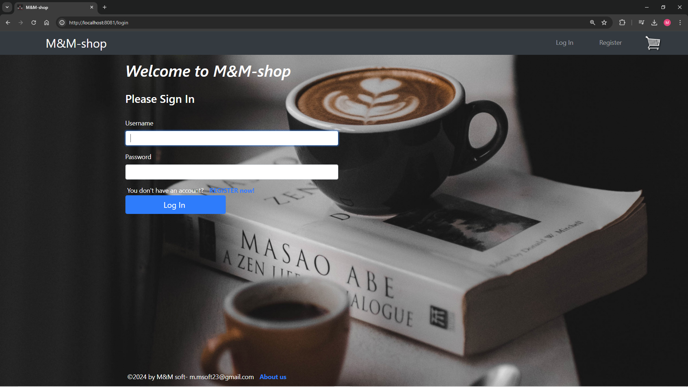
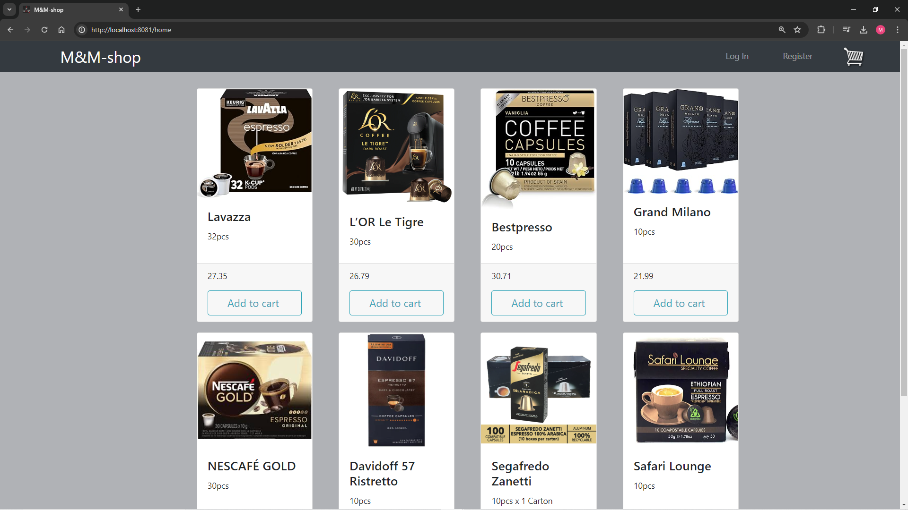
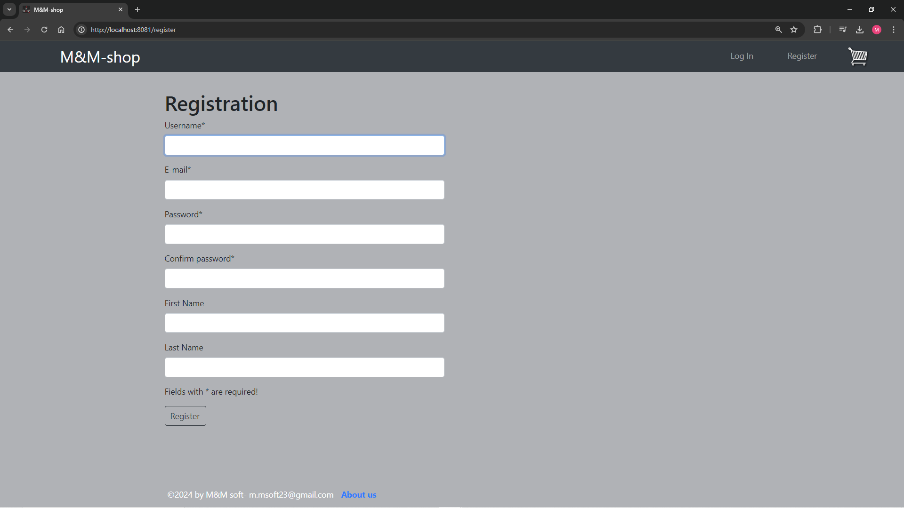
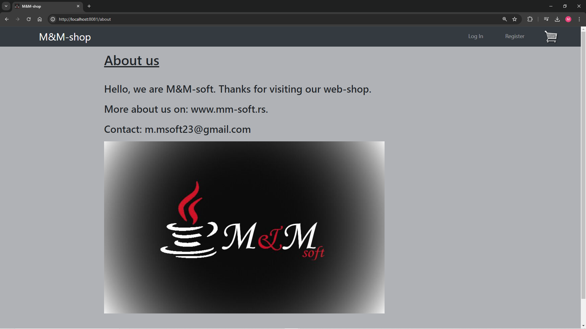
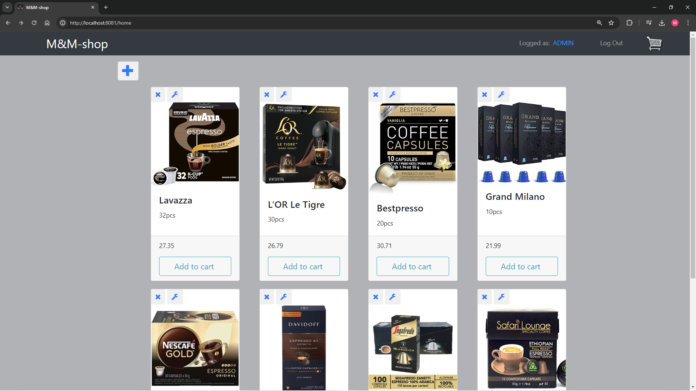
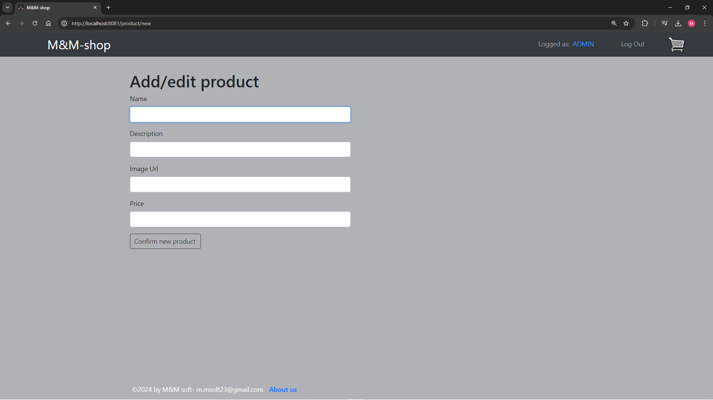

# **Spring Boot - M&M-shop**

Spring project: used **Spring Boot**, **Spring Security**, **Spring Data JPA** with **MySQL**, for views used **Thymeleaf** template and **Bootstrap** CSS framework.

## Screenshots








## Logins

Database name: "web_shop", create before first launch.

Initially there are 2 users in memory:

Login: ```admin``` Password: ```admin``` with **ADMIN** role.

Login: ```user``` Password: ```user``` with **USER** role.

There are 8 products.

NOTE: After first launch change spring.jpa.hibernate.ddl-auto from "create" to "none", and delete initial StartData.

## Roles

**ADMIN** can add, edit and delete products.

**USER** can add products to shopping cart.
